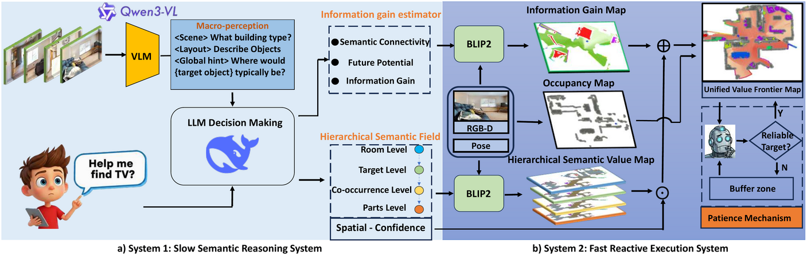

# InfoNav

**InfoNav: A Unified Value Framework Integrating Semantics Value and Information Gain for Zero-Shot Navigation**

> **Paper:** Coming soon

## Architecture



## Overview

InfoNav is an intelligent navigation system for embodied agents in indoor environments, combining Vision-Language Models (VLM) and Large Language Models (LLM) for semantic-aware object navigation tasks. The system proposes a unified value framework that integrates semantic value and information gain for zero-shot navigation.

InfoNav is built on top of [Habitat-Sim](https://github.com/facebookresearch/habitat-sim) and uses ROS for inter-module communication. The system integrates:

- **VLM-based Object Detection**: GroundingDINO, BLIP2 for open-vocabulary detection and image-text matching
- **LLM-based Semantic Reasoning**: Room-object association and hypothesis generation
- **Unified Value Framework**: Combining semantic value with information gain
- **Hybrid Exploration Strategy**: Frontier-based exploration with semantic value maps
- **Robust Navigation Planning**: A* path planning with TSP optimization for multi-target scenarios

## System Requirements

- **OS**: Ubuntu 20.04 / 22.04
- **GPU**: NVIDIA GPU with CUDA support (RTX 3090 or higher recommended)
- **Python**: 3.9+
- **ROS**: ROS Noetic

## Installation

### 1. Prerequisites

#### 1.1 System Dependencies
```bash
sudo apt update
sudo apt-get install libarmadillo-dev libompl-dev
```

#### 1.2 External Code Dependencies
```bash
git clone git@github.com:WongKinYiu/yolov7.git        # yolov7
git clone https://github.com/IDEA-Research/GroundingDINO.git  # GroundingDINO
```

#### 1.3 Model Weights Download

Download the following model weights and place them in the `data/` directory:
- `mobile_sam.pt`: https://github.com/ChaoningZhang/MobileSAM/tree/master/weights/mobile_sam.pt
- `groundingdino_swint_ogc.pth`:
  ```bash
  wget -O data/groundingdino_swint_ogc.pth https://github.com/IDEA-Research/GroundingDINO/releases/download/v0.1.0-alpha/groundingdino_swint_ogc.pth
  ```
- `yolov7-e6e.pt`:
  ```bash
  wget -O data/yolov7-e6e.pt https://github.com/WongKinYiu/yolov7/releases/download/v0.1/yolov7-e6e.pt
  ```

### 2. Setup Python Environment

#### 2.1 Clone Repository
```bash
git clone git@github.com:Pandakingxbc/InfoNav.git
cd InfoNav
```

#### 2.2 Create Conda Environment
```bash
conda env create -f infonav_environment.yaml -y
conda activate infonav
```

#### 2.3 PyTorch
```bash
# You can use 'nvcc --version' to check your CUDA version.
# CUDA 11.8
pip install torch==2.5.0 torchvision==0.20.0 torchaudio==2.5.0 --index-url https://download.pytorch.org/whl/cu118
# CUDA 12.1
pip install torch==2.5.0 torchvision==0.20.0 torchaudio==2.5.0 --index-url https://download.pytorch.org/whl/cu121
# CUDA 12.4
pip install torch==2.5.0 torchvision==0.20.0 torchaudio==2.5.0 --index-url https://download.pytorch.org/whl/cu124
```

#### 2.4 Habitat Simulator
> We recommend using habitat-lab v0.3.1
```bash
# habitat-lab v0.3.1
git clone https://github.com/facebookresearch/habitat-lab.git
cd habitat-lab; git checkout tags/v0.3.1;
pip install -e habitat-lab

# habitat-baselines v0.3.1
pip install -e habitat-baselines
```

**Note:** Any numpy-related errors will not affect subsequent operations, as long as `numpy==1.23.5` and `numba==0.60.0` are correctly installed.

#### 2.5 Others
```bash
pip install salesforce-lavis==1.0.2
cd ..  # Return to InfoNav directory
pip install -e .
```

**Note:** Any numpy-related errors will not affect subsequent operations, as long as `numpy==1.23.5` and `numba==0.60.0` are correctly installed.

### 3. Build ROS Packages

```bash
# Install ROS Noetic first: http://wiki.ros.org/noetic/Installation/Ubuntu
catkin init
catkin config --extend /opt/ros/noetic
catkin build
source devel/setup.bash
```

## 📥 Datasets Download
> Official Reference: https://github.com/facebookresearch/habitat-lab/blob/main/DATASETS.md

### 🏠 Scene Datasets
**Note:** Both HM3D and MP3D scene datasets require applying for official permission first.

#### HM3D Scene Dataset
1. Apply for permission at https://matterport.com/habitat-matterport-3d-research-dataset.
2. Download https://api.matterport.com/resources/habitat/hm3d-val-habitat-v0.2.tar.
3. Save `hm3d-val-habitat-v0.2.tar` to the `InfoNav/` directory, then run:
```bash
mkdir -p data/scene_datasets/hm3d/val
mv hm3d-val-habitat-v0.2.tar data/scene_datasets/hm3d/val/
cd data/scene_datasets/hm3d/val
tar -xvf hm3d-val-habitat-v0.2.tar
rm hm3d-val-habitat-v0.2.tar
cd ../..
ln -s hm3d hm3d_v0.2  # Create a symbolic link for hm3d_v0.2
```

#### MP3D Scene Dataset
1. Apply for download access at https://niessner.github.io/Matterport/.
2. After successful application, you will receive a `download_mp.py` script, which should be run with `python2.7` to download the dataset.
3. After downloading, place the files in `InfoNav/data/scene_datasets`.

### 🎯 Task Datasets
```bash
# Create necessary directory structure
mkdir -p data/datasets/objectnav/hm3d
mkdir -p data/datasets/objectnav/mp3d

# HM3D-v0.1
wget -O data/datasets/objectnav/hm3d/v1.zip https://dl.fbaipublicfiles.com/habitat/data/datasets/objectnav/hm3d/v1/objectnav_hm3d_v1.zip
unzip data/datasets/objectnav/hm3d/v1.zip -d data/datasets/objectnav/hm3d && mv data/datasets/objectnav/hm3d/objectnav_hm3d_v1 data/datasets/objectnav/hm3d/v1 && rm data/datasets/objectnav/hm3d/v1.zip

# HM3D-v0.2
wget -O data/datasets/objectnav/hm3d/v2.zip https://dl.fbaipublicfiles.com/habitat/data/datasets/objectnav/hm3d/v2/objectnav_hm3d_v2.zip
unzip data/datasets/objectnav/hm3d/v2.zip -d data/datasets/objectnav/hm3d && mv data/datasets/objectnav/hm3d/objectnav_hm3d_v2 data/datasets/objectnav/hm3d/v2 && rm data/datasets/objectnav/hm3d/v2.zip

# MP3D
wget -O data/datasets/objectnav/mp3d/v1.zip https://dl.fbaipublicfiles.com/habitat/data/datasets/objectnav/m3d/v1/objectnav_mp3d_v1.zip
unzip data/datasets/objectnav/mp3d/v1.zip -d data/datasets/objectnav/mp3d/v1 && rm data/datasets/objectnav/mp3d/v1.zip
```

<details>
<summary>Make sure that the folder <code>data</code> has the following structure:</summary>

```
data
├── datasets
│   └── objectnav
│       ├── hm3d
│       │   ├── v1
│       │   │   ├── train
│       │   │   ├── val
│       │   │   └── val_mini
│       │   └── v2
│       │       ├── train
│       │       ├── val
│       │       └── val_mini
│       └── mp3d
│           └── v1
│               ├── train
│               ├── val
│               └── val_mini
├── scene_datasets
│   ├── hm3d
│   │   └── val
│   │       ├── 00800-TEEsavR23oF
│   │       ├── 00801-HaxA7YrQdEC
│   │       └── .....
│   ├── hm3d_v0.2 -> hm3d
│   └── mp3d
│       ├── 17DRP5sb8fy
│       ├── 1LXtFkjw3qL
│       └── .....
├── groundingdino_swint_ogc.pth
├── mobile_sam.pt
└── yolov7-e6e.pt
```

Note that `train` and `val_mini` are not required and you can choose to delete them.
</details>

## Usage

### Quick Start

1. **Start ROS Core**
```bash
roscore
```

2. **Launch Exploration Node**
```bash
roslaunch exploration_manager exploration.launch
```

3. **Run Evaluation**
```bash
python habitat_evaluation.py --config config/habitat_eval_hm3dv2.yaml
```

### Configuration

Main configuration files:
- `config/habitat_eval_hm3dv1.yaml` - HM3D-v1 dataset config
- `config/habitat_eval_hm3dv2.yaml` - HM3D-v2 dataset config
- `config/habitat_eval_mp3d.yaml` - MP3D dataset config
- `src/planner/exploration_manager/config/algorithm.xml` - Algorithm parameters

### Manual Control

For testing and debugging:
```bash
python habitat_manual_control.py
```

## Project Structure

```
InfoNav/
├── habitat_evaluation.py      # Main evaluation loop
├── params.py                  # Global constants
├── src/planner/               # C++ ROS planning modules
│   ├── exploration_manager/   # FSM and exploration logic
│   ├── plan_env/              # Map representations
│   └── path_searching/        # A* path planning
├── vlm/                       # Vision-Language Models
├── llm/                       # Large Language Models
├── basic_utils/               # Utility functions
├── habitat2ros/               # Habitat-ROS bridge
└── config/                    # Configuration files
```

## Citation

If you find this work useful, please cite:

```bibtex
@article{infonav2025,
  title={InfoNav: A Unified Value Framework Integrating Semantics Value and Information Gain for Zero-Shot Navigation},
  author={},
  journal={},
  year={2025}
}
```

## License

This project is released under the MIT License.

## Acknowledgements

This project builds upon several excellent open-source projects:
- [Habitat-Sim](https://github.com/facebookresearch/habitat-sim)
- [GroundingDINO](https://github.com/IDEA-Research/GroundingDINO)
- [BLIP2](https://github.com/salesforce/LAVIS)

## Contact

For questions or issues, please open an issue on GitHub.

## TODO

- [ ] Release real-world deployment code
- [ ] Release ROS2 support version
